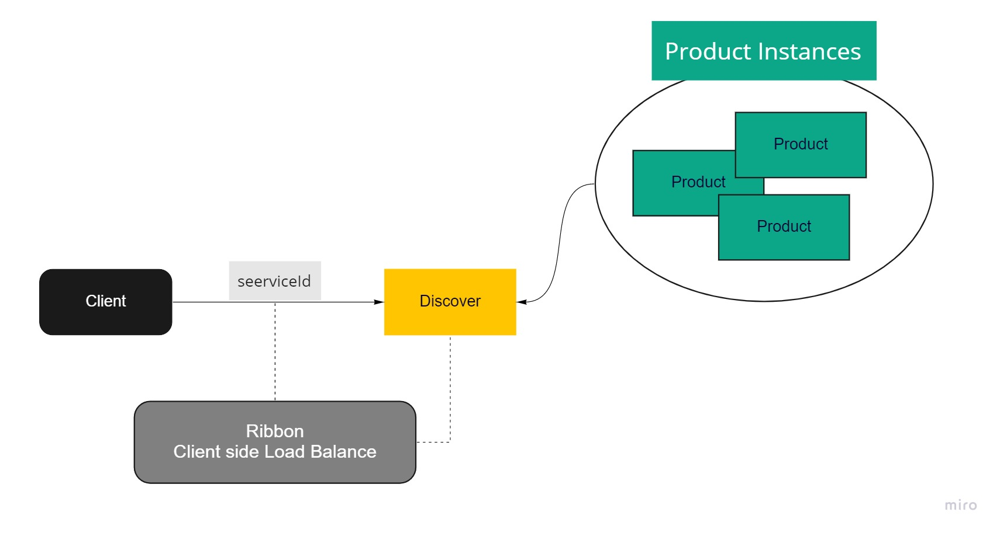

# Eureka Client

References

- [Service Discovery: Eureka Clients](https://cloud.spring.io/spring-cloud-netflix/multi/multi__service_discovery_eureka_clients.html)
- [Spring Cloud and Spring Boot, Part 1: Implementing Eureka Server - dzone](https://dzone.com/articles/spring-cloud-amp-spring-bootimplementing-eureka-se)


## Client Side Load Balance



- **Ribbon**: Client Side Load Balance, 
    for example, an @Autowired annotation in a restTemplate instance can be together @LoadBalanced and all the magic of Client side load balance will already happen.

an example to use:

```java
@Autowired
DiscoveryClient discoveryClient;


discoveryClient.getInstances("$serviceId").stream()
    .foreach(client ->
        System.out.println(client.getPort);
    )
)
```

- **Feign**: Client side Load Balance, `@EnableFeignClient`

```java
@FeignClient
interface ServiceXXXClient {

    @RequestMapping("/{document}")
    ServiceXXXDTO getDomainData(@PathVariable String document)

}


@Autowired
ServiceXXXClient serviceXXXClient;

serviceXXXClient.getDomainData("123")
```