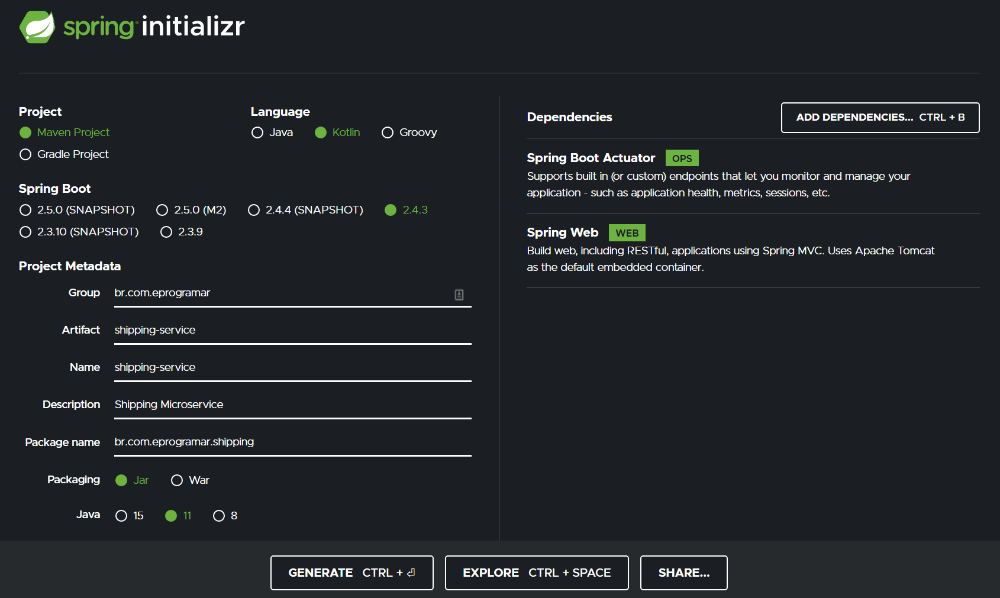

# Microservices

To Create 4 microservices

- customer-service
- product-service
- order-service
- shipping-service



## Configure Maven Multi Module Project

Into microservices folder to create `pom.xml`

```xml
<project xmlns="http://maven.apache.org/POM/4.0.0"
  xmlns:xsi="http://www.w3.org/2001/XMLSchema-instance"
  xsi:schemaLocation="http://maven.apache.org/POM/4.0.0 http://maven.apache.org/xsd/maven-4.0.0.xsd">
  <modelVersion>4.0.0</modelVersion>
  <groupId>com.eprogramar</groupId>
  <artifactId>microservices</artifactId>
  <version>0.0.1-SNAPSHOT</version>
  <packaging>pom</packaging>

  <parent>
    <groupId>org.springframework.boot</groupId>
    <artifactId>spring-boot-starter-parent</artifactId>
    <version>2.4.3</version>
    <relativePath/>
  </parent>

  <modules>
    <module>customer-service</module>
    <module>product-service</module>
    <module>order-service</module>
    <module>shipping-service</module>
  </modules>

  <build>
    <pluginManagement>
      <plugins>
        <plugin>
          <groupId>org.apache.maven.plugins</groupId>
          <artifactId>maven-compiler-plugin</artifactId>
          <configuration>
            <source>11</source>
            <target>11</target>
          </configuration>
        </plugin>
      </plugins>
    </pluginManagement>
  </build>

  <dependencies>
    <dependency>
      <groupId>org.junit.jupiter</groupId>
      <artifactId>junit-jupiter-api</artifactId>
      <version>5.7.1</version>
      <scope>test</scope>
    </dependency>
  </dependencies>
</project>
```

In Each Microservices replace `parent block`

```xml
<parent>
    <groupId>com.eprogramar</groupId>
    <artifactId>microservices</artifactId>	
    <version>0.0.1-SNAPSHOT</version>
</parent>
```
