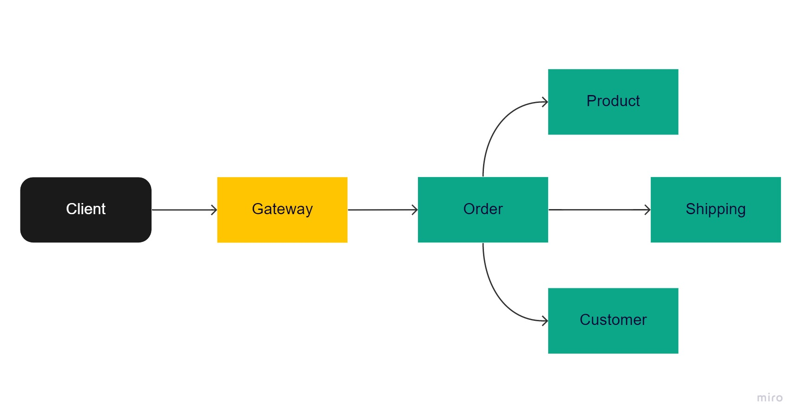
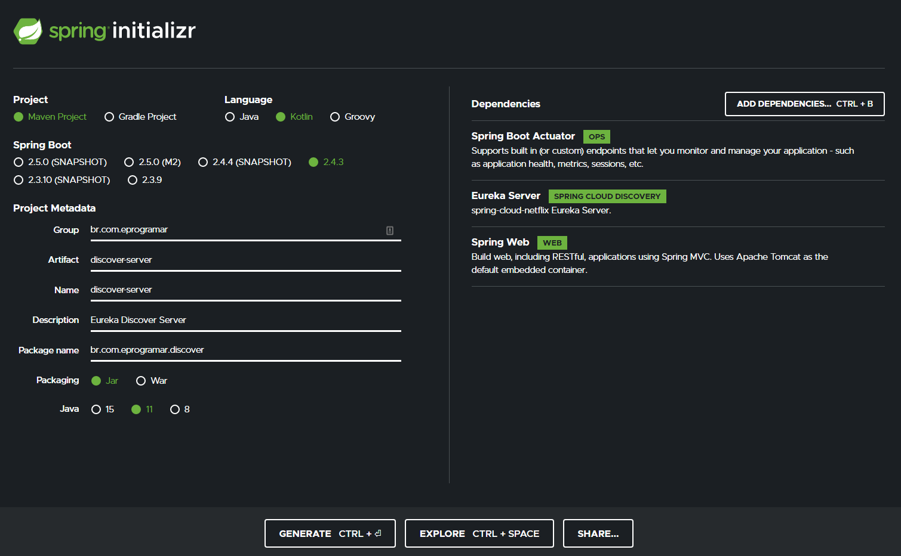
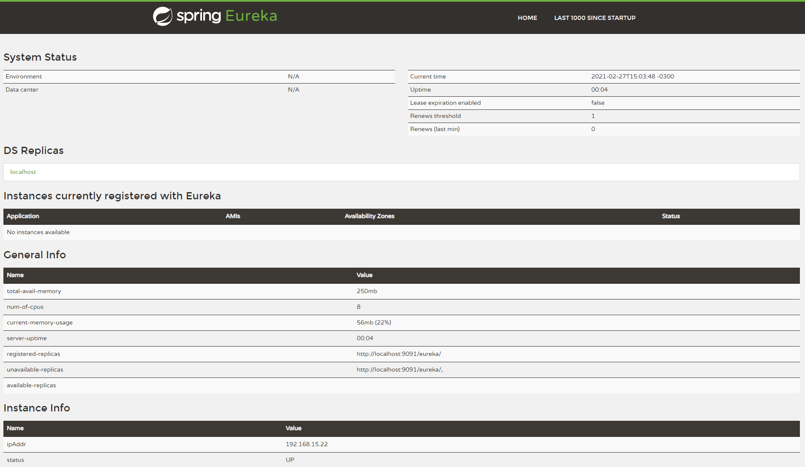
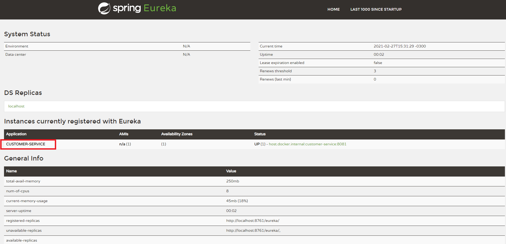
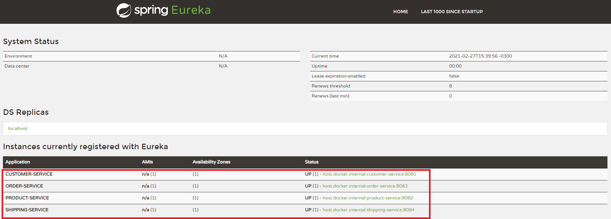

# Microservices



To Create 4 microservices

- customer-service
- product-service
- order-service
- shipping-service


## Configure Maven Multi Module Project

Into microservices folder to create `pom.xml`

```xml
<project xmlns="http://maven.apache.org/POM/4.0.0"
  xmlns:xsi="http://www.w3.org/2001/XMLSchema-instance"
  xsi:schemaLocation="http://maven.apache.org/POM/4.0.0 http://maven.apache.org/xsd/maven-4.0.0.xsd">
  <modelVersion>4.0.0</modelVersion>
  <groupId>com.eprogramar</groupId>
  <artifactId>microservices</artifactId>
  <version>0.0.1-SNAPSHOT</version>
  <packaging>pom</packaging>

  <parent>
    <groupId>org.springframework.boot</groupId>
    <artifactId>spring-boot-starter-parent</artifactId>
    <version>2.4.3</version>
    <relativePath/>
  </parent>

  <modules>
    <module>customer-service</module>
    <module>product-service</module>
    <module>order-service</module>
    <module>shipping-service</module>
  </modules>

  <build>
    <pluginManagement>
      <plugins>
        <plugin>
          <groupId>org.apache.maven.plugins</groupId>
          <artifactId>maven-compiler-plugin</artifactId>
          <configuration>
            <source>11</source>
            <target>11</target>
          </configuration>
        </plugin>
      </plugins>
    </pluginManagement>
  </build>

  <dependencies>
    <dependency>
      <groupId>org.junit.jupiter</groupId>
      <artifactId>junit-jupiter-api</artifactId>
      <version>5.7.1</version>
      <scope>test</scope>
    </dependency>
  </dependencies>
</project>
```

In Each Microservices replace `parent block`

```xml
<parent>
    <groupId>com.eprogramar</groupId>
    <artifactId>microservices</artifactId>	
    <version>0.0.1-SNAPSHOT</version>
</parent>
```

## Eureka Server

[Eureka Server Reference](https://dzone.com/articles/microservice-spring-cloud-eureka-server-configurat)



Set Annotation `@EnableEurekaServer`

```kotlin
package br.com.eprogramar.discover

import org.springframework.boot.autoconfigure.SpringBootApplication
import org.springframework.boot.runApplication
import org.springframework.cloud.netflix.eureka.server.EnableEurekaServer

@EnableEurekaServer
@SpringBootApplication
class DiscoverServerApplication

fun main(args: Array<String>) {
	runApplication<DiscoverServerApplication>(*args)
}

```

Set properties to configure as a Eureka Server

```properties
spring.application.name=DiscoverServer
eureka.client.serviceUrl.defaultZone=http://localhost:9091/eureka/
server.port=8761
eureka.client.register-with-eureka=false
eureka.client.fetch-registry=false
```

Name	| Description
------|------------
spring.application.name	              | Unique name for a Eureka server service.
eureka.client.serviceUrl.defaultZone  | It consults with other Eureka servers to sync the service registry. As it is in standalone mode, I am giving the local server address.
server.port                           |	In which port the server will be bound.
eureka.client.register-with-eureka    | This determines if this server registers itself as a client; as I said earlier, the Eureka server is also acting as a client so that it can sync the registry. The value being false means it prevents itself from acting as a client.
eureka.client.fetch-registry          | Does not register itself in the service registry.

 Now our Eureka server setup is complete.
 We will now run this project as a Java application. Now hit the following URL: http://localhost:8761. 
 You will see the following dashboard:

 


 ## Configure Eureka Client

At pom parent in microservices root add:

1. property:

```xml
  <properties>
    <spring-cloud.version>2020.0.1</spring-cloud.version>
  </properties>
```

2. Dependency Management

```xml
  <dependencyManagement>
    <dependencies>
      <dependency>
        <groupId>org.springframework.cloud</groupId>
        <artifactId>spring-cloud-dependencies</artifactId>
        <version>${spring-cloud.version}</version>
        <type>pom</type>
        <scope>import</scope>
      </dependency>
    </dependencies>
  </dependencyManagement>
```

3. Dependence

 ```xml
<dependency>
  <groupId>org.springframework.cloud</groupId>
  <artifactId>spring-cloud-starter-netflix-eureka-client</artifactId>
</dependency>
 ```

 After all configurations, In each microservices configure as Eureka Client:

 Fist add Annotation `@EnableDiscoveryClient` at Application Class

 ```kotlin
 package br.com.eprogramar.customer

import org.springframework.boot.autoconfigure.SpringBootApplication
import org.springframework.boot.runApplication
import org.springframework.cloud.client.discovery.EnableDiscoveryClient

@EnableDiscoveryClient
@SpringBootApplication
class CustomerServiceApplication

fun main(args: Array<String>) {
	runApplication<CustomerServiceApplication>(*args)
}
```

Then add the properties 

```
spring.application.name=customer-service
server.port=8081
eureka.client.service-url.defaultZone=http://localhost:8761/eureka/
```

Now, first running the Eureka Server then running the Customer Service and look for Eureka Dashboard



After configured and Running all the Microservices the Eureka Dashboard should look like this:



[Eureka Client Reference](https://dzone.com/articles/spring-cloud-amp-spring-bootimplementing-eureka-se)